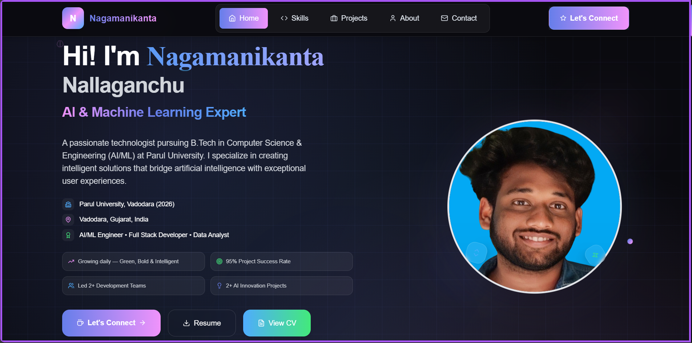
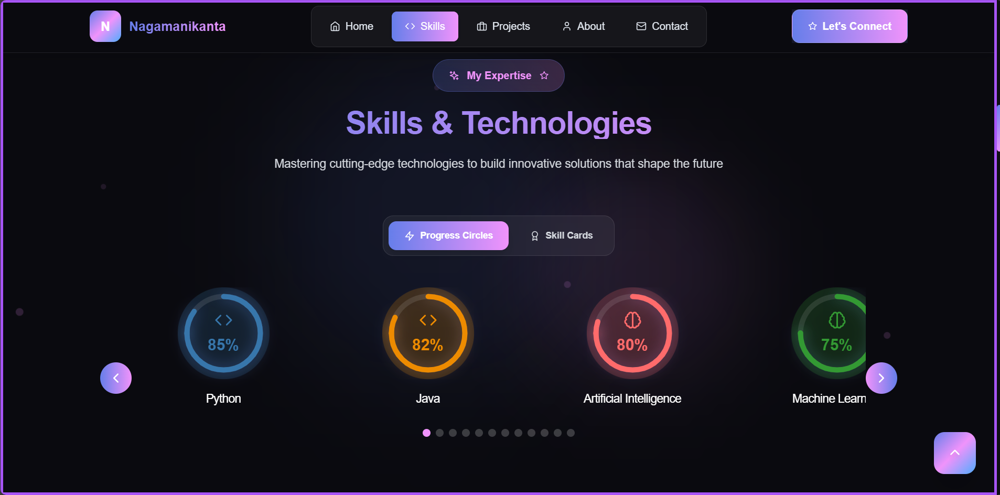
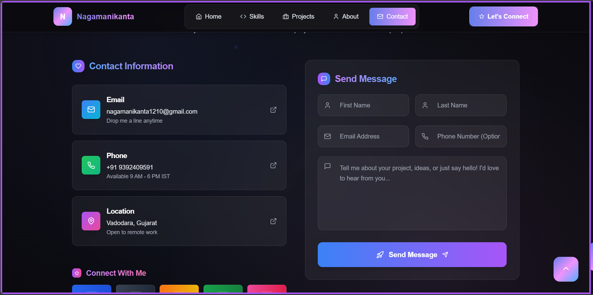

<h1 align="center">🚀 Personal Portfolio</h1>

<p align="center">
  <strong>A modern, animated, and fully responsive portfolio website</strong><br />
  Built using <code>React.js</code>, <code>TailwindCSS</code>, and <code>Framer Motion</code>.
</p>

<p align="center">
  Designed to showcase my technical skills, featured projects, and contact information — all wrapped in an elegant and interactive UI.
</p>

<p align="center">
  🌐 <a href="https://your-portfolio-link.com" target="_blank"><strong>Live Preview</strong></a> &nbsp;|&nbsp;
  📬 <a href="mailto:your.email@example.com"><strong>Get in Touch</strong></a>
</p>
---

## 🌐 Live Demo

> 🚀 **View Online**: [https://your-portfolio-link.com](https://your-portfolio-link.com)

<p align="center">
  
</p>

---

## 🌐 Live Demo

> 🚀 Check it live: [your-portfolio-link.com](https://your-portfolio-link.com)


> _(or use `home.png` if GIF is not available)_

---

## 📸 Screenshots

| Home Page | Skills Section |
|-----------|----------------|
|  |  |

| Projects Section | Contact Section |
|------------------|-----------------|
|  |  |

---

## 🧰 Tech Stack

| Technology       | Role/Use                           |
|------------------|-------------------------------------|
| ⚛️ React         | Component-based UI building         |
| 💨 Tailwind CSS   | Utility-first modern styling        |
| 🎞️ Framer Motion | Smooth animations and transitions   |
| ⚡ Vite           | Lightning-fast dev & build tooling  |

---
## ✨ Features

- 🎨 Responsive and modern design
- 🎯 Fully modular React component structure
- 🖱️ Custom animated cursor follower
- ✨ Smooth transitions using Framer Motion
- 🌌 Particles animated background
- 🛠️ Easy content customization
- 🧩 Scroll to top functionality
- 📫 Contact form layout (email/social ready)

---

## 📁 Project Structure

```bash
src/
├── assets/                  # Static assets (images, icons)
├── components/              # Modular & reusable components
│   ├── Contact.jsx
│   ├── CursorFollower.jsx
│   ├── Details.jsx
│   ├── Footer.jsx
│   ├── Header.jsx
│   ├── LoadingScreen.jsx
│   ├── Navigation.jsx
│   ├── Notifications.jsx
│   ├── ParticlesBackground.jsx
│   ├── Projects.jsx
│   ├── ScrollToTop.jsx
│   └── Skills.jsx
├── App.jsx                  # Root component
├── index.css                # Tailwind and global styles
└── main.jsx                 # Application entry point

```
---


---

## 🚀 Getting Started

### ✅ Prerequisites

Ensure you have the following installed:

- Node.js (v16+ recommended)
- npm or yarn

### 📦 Installation

```bash
# Clone the repository
git clone https://github.com/yourusername/portfolio-website.git

# Navigate to the project folder
cd portfolio-website

# Install dependencies
npm install

# Start the development server
npm run dev

